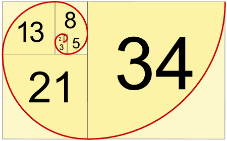
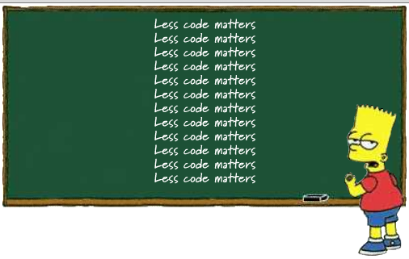

# FP i Scala

--

## Kaare Nilsen

## Jon-Anders Teigen

--

## Lære litt FP
* og litt scala <!-- .element class="fragment" -->

--

## Hvordan
* teori
* oppgaver
* jobb i par!

--

## Hva er FP ?
* FP er programmering med funksjoner!
* funksjoner uten sideeffekter <!-- .element class="fragment" -->

--

## Sideeffekt
* endre en variabel
* mutere en datastruktur
* sette et felt på et objekt
* kaste exceptions
* skrive og lese fra konsoll
* skrive og lese fra nettverk
* etc..

--

## function A => B

`is a computation which relates every value a of type A to exactly one
value b of type B such that b is determined solely by the value of a`

--

## referentially transparent
* substitution model
* vi kan erstatte et uttrykk med resultatet

--

## barneskolen
```scala
 2 + 3  + 4  = 9
(2 + 3) + 4  = 9
(5      + 4) = 9
          9  = 9```

--

```scala
val a = "Hello"
val b = a + ", World"
val c = a + ", World"
```

```scala
val b = "Hello" + ", World"
val c = "Hello" + ", World"
```

--

## referentially opaque
```scala
val a = new StringBuilder("Hello")
val b = a.append(", World").toString
val c = a.append(", World").toString
```

```
// b = "Hello, World
// c = "Hello, World, World```

--

> begrensningene i FP gjør programmene MYE enklere å forholde seg til

--

## rekursjon

```scala
def fac(n:Int):Int =
  if(n <= 0) 1 else n * fac(n - 1)
```

--

## tail-recursion

```scala
def factorial(n:Int) = {
  @tailrec
  def go(n:Int, acc:Int):Int =
    if(n <= 0) acc else go(n - 1, n * acc)

  go(n, 1)
}
```

--

## oppgave 1


> (helst tail-recursive)

--

## overlevde alle ?


--

```scala
def fib(n:Int):Int = {
  @tailrec
  def go(previous:Int, current:Int, n:Int):Int =
    if(n == 0) previous
    else go(current, previous + current, n - 1)
  go(0, 1, n)
}
```

--

```scala
def fib0(n:Int):Int =
  if(n == 0 || n == 1) n
  else fib0(n - 1) + fib(n - 2)
```

--

## førsteklasses funksjoner
* kan sendes som parameter
* kan returneres

--

## forbedringspotensiale ?
```scala
def formatFac(n:Int) =
  s"factorial av $n = ${factorial(n)}"

def formatFib(n:Int) =
  s"fibonacci av $n = ${fib(n)}"
```

--

## dry


--

```scala
def format(name:String, f:Int => Int, n:Int) =
  s"$name av $n = ${f(n)}"

format("fibonacci", fibonacci, 10)
```

--

## monomorphic functions
```scala
def findFirst(ss:Array[String], s:String) = {
  @tailrec
  def go(n:Int):Int =
    if(n >= ss.length) -1
    else if(ss(n) == s) n
    else go(n + 1)
  go(0)
}
```

Note: fancy navn for funksjon som fungerer for 1 type

--

## polymorphic functions
```scala
def findFirst[A](as:Array[A], p:A => Boolean) = {
  @tailrec
  def go(n:Int):Int =
    if(n >= as.length) -1
    else if(p(as(n))) n
    else go(n + 1)
  go(0)
}
```

Note:
polymorfisk funksjon fungerer for alle typer, som begrenser mulige implementasjoner

--

## polymorphic ..
```scala
def partial1[A, B, C](a: A, f: (A, B) => C): B => C =
  ???
```

<pre><code class="fragment scala" data-trim>
def partial1[A, B, C](a: A, f: (A, B) => C): B => C =
  (b: B) => ???
</code></pre>

<pre><code class="fragment scala" data-trim>
def partial1[A, B, C](a: A, f: (A, B) => C): B => C =
  (b: B) => f(a, b)
</code></pre>


Note:
Kun 1 mulig implementasjon, takket være polymorfismen
Følg typesignaturen!

--

## curry
```scala
def curry[A, B, C](f:(A, B) => C): A => B => C =
  ???
```

<pre><code class="fragment scala" data-trim>
def curry[A, B, C](f:(A, B) => C): A => B => C =
  a => b => f(a, b)
</code></pre>

--

## uncurry
```scala
def uncurry[A, B, C](f:A => B => C): (A, B) => C =
  ???
```

<pre><code class="fragment scala" data-trim>
def uncurry[A, B, C](f:A => B => C): (A, B) => C =
  (a, b) => f(a)(b)
</code></pre>

Note: Etter matematikerene Haskell Curry, som også har gitt navn til språket Haskell

--

## composition
```scala
def compose[A, B, C](f:B => C, g:A => B):A => C =
  ???
```

<pre><code class="fragment scala" data-trim>
def compose[A, B, C](f:B => C, g:A => B):A => C =
  a => f(g(a))
</code></pre>

<pre><code class="fragment scala" data-trim>
def andThen[A, B, C](g:A => B, f:B => C):A => C =
  compose(f, g)
</code></pre>

--

## funksjonelle datastrukturer

--

<!-- .slide: data-background="img/immutable.jpg" data-background-size="80%" -->

--

## funksjonelle datastrukturer
* immutable
* pattern matching
* funksjoner

--


--

## single-linket liste
```scala
sealed trait List[+A]
case class Cons[A](head:A, tail:List[A]) extends List[A]
case object Nil extends List[Nothing]

object List {
  def sum(ints:List[Int]):Int = ints match {
    case Nil         => 0
    case Cons(x, xs) => x + sum(xs)
  }

  def product(ds:List[Double]):Double = ds match {
    case Nil          => 1.0
    case Cons(0.0, _) => 0.0
    case Cons(x, xs)  => x * product(xs)
  }
}
```

--

<!-- .slide: data-background="#fff" -->


--

## pattern matching
```scala
val list = Cons(1, Cons(2, Cons(3, Nil)))

list match { case _ => 42 } // 42 - wildcard pattern

list match { case Cons(h, _) => h } // 1 - variable pattern

list match { case Cons(_, t) => t } // Cons(2, Cons(3, Nil))

list match { case Nil => 42 } // MatchError @ Runtime
```

--

## hva er x ?
```scala
val x = Cons(1, Cons(2, Cons(3, Cons(4, Cons(5, Nil))))) match {
  case Cons(x, Cons(2, Cons(4, _))) => x
  case Nil => 42
  case Cons(x, Cons(y, Cons(3, Cons(4, _)))) => x + y
  case Cons(h, t) => h + sum(t)
  case _ => 101
}
```

--

## "add" / "remove"
```scala
val xs:List[Int] = Cons(2, Cons(3, Nil))
val ys = Cons(1, xs)

val xs1 = ys match {
  case Cons(_, t) => t
}

// xs == xs1
```

--

## dropWhile
```scala
def dropWhile[A](l:List[A], f:A => Boolean):List[A] = l match {
  case Cons(x, xs) if f(x) => dropWhile(xs, f)
  case                   _ => l
}

val list = Cons(1, Cons(2, Cons(3, Nil)))
dropWhile(list, (i:Int) => i < 2)
```

--

## forbedre typeinference
```scala
def dropWhile[A](l:List[A])(f:A => Boolean):List[A] = l match {
  case Cons(x, xs) if f(x) => dropWhile(xs)(f)
  case                   _ => l
}

val list = Cons(1, Cons(2, Cons(3, Nil)))
dropWhile(list)(i => i < 2)
```

--

## OO style
```scala
sealed trait List[+A]{
  def dropWhile(f:A => Boolean):List[A] = this match {
    case Cons(x, xs) if f(x) => xs.dropWhile(f)
    case                   _ => this
  }
}

val list = Cons(1, Cons(2, Cons(3, Nil)))
list.dropWhile(i => i < 2)

list.dropWhile(_ < 2)
```

--


